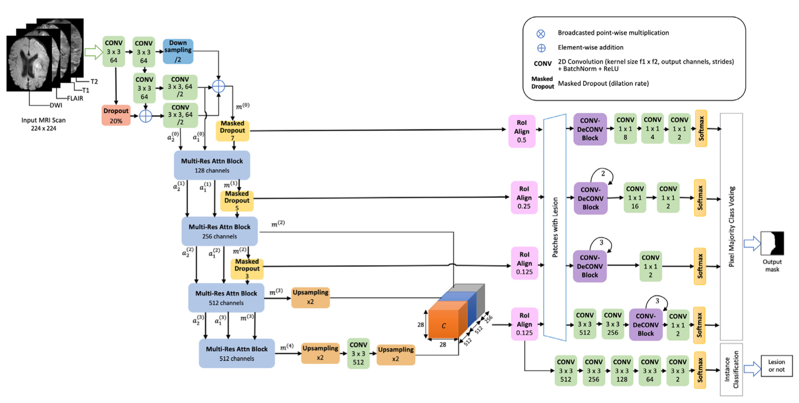

# Multi-Scale Region Aligned Ensemble Deconvolutional CNN for Ischemic Lesion Segmentation

**Contributors:** Hariharan, M., Karthik, R., Menaka, R.

Highlights
- The proposed architecture correlates the context from multi-scaled feature maps for better segmentation of ischemic lesion.
- It uses classification and segmentation functional heads to counter class imbalance problem.
- The proposed model converged excellently and achieved a dice-coefficient of 0.775.

The first and foremost step in the diagnosis of ischemic stroke is the delineation of the lesion from radi- ological images for effective treatment planning. Manual delineation of the lesion by radiological experts is generally laborious and time-consuming. Sometimes, it is prone to intra-observer and inter-observer variability. State of the art deep architectures based on Fully Convolutional Networks (FCN) and cascaded CNNs have shown good results in automated lesion segmentation. This work proposes a series of en- hancements over the learning paradigm in the existing methods, by focusing on learning meticulous fea- ture representations through the CNN layers for accurate ischemic lesion segmentation from multimodal MRI. Multiple levels of losses, integration of features from multiple scales, an ensemble of prediction maps from sub-networks are employed to enable the CNN to correlate between features seen from differ- ent receptive fields. To allow for progressive refinement of features from block to block, a custom dropout module has been proposed that suppresses noisy features. Multi-branch residual connections and atten- tion mechanisms were also included in the CNN blocks to enable the integration of information from multiple receptive fields and selectively weigh significant features. Also, to tackle data imbalance both at voxel and sample level, patch-based modeling and separation of concerns into classification & segmenta- tion functional branches are proposed. By incorporating the above mentioned architectural enhancements, the proposed deep architecture was able to achieve better segmentation performance against the existing models. The proposed approach was evaluated on the ISLES 2015 SISS dataset, and it achieved a mean dice coefficient of 0.775. By combining sample classification and lesion segmentation into a fully auto- mated framework, the proposed approach has yielded better results compared to most of the existing works.

**Citation**: Karthik, R., Menaka, R., Hariharan, M., & Won, D. (2021). Ischemic lesion segmentation using ensemble of multi-scale region aligned CNN. Computer Methods and Programs in Biomedicine, 200, 105831.
